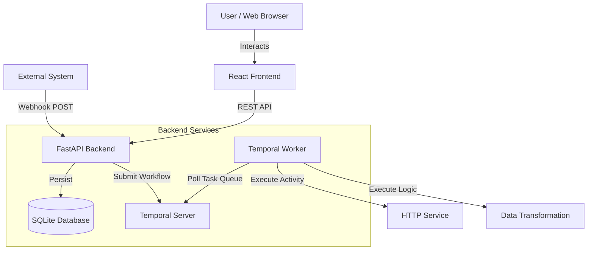

# SagePilot — Workflow Automation Engine

A simplified workflow automation engine inspired by tools like n8n and Zapier, built with **React**, **FastAPI**, and **Temporal**. This system allows users to visually create, configure, and execute multi-step workflows with durable execution semantics.

## 🚀 Key Features

*   **Visual Workflow Builder**: Intuitive drag-and-drop interface powered by React Flow.
*   **Durable Execution**: Orchestrated by Temporal, ensuring workflows survive failures and server restarts.
*   **Rich Node Library**:
    *   **Triggers**: Manual (JSON payload), Webhook (HTTP POST).
    *   **Actions**: HTTP Request, Transform Data (Multiply, Uppercase).
    *   **Logic**: Decision (Branching with operators), Wait (Durable timers).
*   **Real-time Feedback**: Live execution tracing status polling.
*   **Configuration Management**: Server-validated node configurations persisted in SQLite.

## 🏗️ Architecture

The system follows a decoupled architecture where the frontend is strictly a presentation layer, and all business logic resides on the backend.



### Components

1.  **Frontend (React + Vite)**:
    *   **State Management**: `Zustand` for global store (nodes, edges, execution status).
    *   **UI Library**: `Tailwind CSS` for styling, `Lucide React` for icons.
    *   **Visualization**: `React Flow` for the canvas.

2.  **Backend (Python FastAPI)**:
    *   **API Layer**: REST endpoints for saving, loading, executing workflows.
    *   **Persistence**: `SQLAlchemy` with `SQLite` for storing workflow definitions.
    *   **Validation**: Graph cycle detection and configuration validation.

3.  **Orchestration (Temporal)**:
    *   **Workflows**: Define the DAG traversal and execution logic.
    *   **Activities**: Execute individual node tasks (HTTP requests, transformations).
    *   **Worker**: Python worker process that executes the workflows.

## 🛠️ Tech Stack

*   **Frontend**: React (Vite), Tailwind CSS, React Flow, Zustand, Axios.
*   **Backend**: Python 3.10+, FastAPI, SQLAlchemy, Pydantic.
*   **Orchestration**: Temporal (Python SDK).
*   **Database**: SQLite (File-based).

## 🚦 Setup Instructions

This project is configured with a strict separation between **Local Development** and **Production Deployment**.

### 1. Prerequisites
*   Node.js & npm
*   Python 3.10+
*   Temporal Server (running locally)

### 2. Local Development (4-Terminal Setup)

For local development, we use separate processes for maximum flexibility.

**Terminal 1: Temporal Server**
```bash
temporal server start-dev
```

**Terminal 2: Backend API**
```bash
cd workflow_orchestrator
# Activate .venv
uvicorn sagepilot.backend.main:app --reload --port 8000
# Output should say: "ℹ️ Embedded worker mode disabled - run worker separately"
```

**Terminal 3: Temporal Worker**
```bash
cd workflow_orchestrator
# Activate .venv
python -m sagepilot.backend.temporal_workflows.worker
```

**Terminal 4: Frontend UI**
```bash
cd workflow_orchestrator/sagepilot/frontend
npm run dev
```
*UI available at http://localhost:5173 (connects to localhost:8000 via `.env`)*

---

## 📚 API Documentation

### Workflow Management
*   `POST /api/workflows/save`: Save a workflow (validates structure).
*   `GET /api/workflows/saved/{name}`: Load a workflow by name.
*   `GET /api/workflows/saved`: List all saved workflows.
*   `POST /api/workflows/execute`: Execute a workflow immediately.

### Webhooks
*   `POST /api/webhooks/{workflow_id}`: Trigger a workflow via webhook. Accepts JSON payload.

### Export/Import
*   `GET /api/workflows/{id}/export`: Export workflow as JSON.
*   `POST /api/workflows/import`: Import workflow JSON.

## 🧪 Workflow Execution

When you click **Run**:
1.  Frontend sends the workflow definition (Nodes + Edges + Config) to `/api/workflows/execute`.
2.  Backend validates the graph (checks for cycles, disconnected nodes).
3.  Backend starts a Temporal Workflow with a unique `run_id`.
4.  Temporal Worker (either standalone or embedded) picks up the task and traverses the DAG.
5.  Frontend polls `/api/executions/{run_id}` to show real-time status and logs.

## 🚀 Deployment & Environment Separation

The codebase uses environment variables to switch between local and production modes seamlessly.

| Variable | Local Value | Production Value | Purpose |
| :--- | :--- | :--- | :--- |
| `EMBEDDED_WORKER` | `false` | `true` | Controls if worker runs inside API (free-tier fix) |
| `VITE_API_URL` | `http://localhost:8000` | `https://your-api.com` | Tells frontend where the backend is |
| `TEMPORAL_HOST` | `localhost:7233` | `namespace.tmprl.cloud` | Temporal connection string |

### Deployment Guides:
*   [CONFIG_MODES.md](CONFIG_MODES.md) - **Detailed explanation of environment separation.**
*   [DEPLOYMENT.md](DEPLOYMENT.md) - Step-by-step deployment instructions.
*   [FREE_TIER_SOLUTION.md](FREE_TIER_SOLUTION.md) - Deep dive into the embedded worker pattern.

**Note**: Due to Temporal's infrastructure requirements, a walkthrough video demonstration is provided as the primary demo per assignment guidelines.

## 🎨 Design Decisions & Trade-offs

### 1. Temporal for Orchestration
**Decision**: Chosen over custom Python background tasks or Celery.
*   **Rationale**: Temporal provides "Durable Execution." If the server crashes during a `Wait` node, Temporal remembers the state and resumes once the worker is back online. It handles retries and state management automatically.
*   **Trade-off**: Increases system complexity by requiring a Temporal server/cluster, but the gain in reliability is massive for workflow engines.

### 2. Topological Traversal (DAG Execution)
**Decision**: Implemented a queue-based topological sort execution in the workflow.
*   **Rationale**: Traditional linear execution cannot handle complex DAGs where nodes might have multiple outputs or parallel branches. Our engine ensures that each node only executes once its predecessors have completed (or been skipped by a decision).
*   **Handling Decisions**: If a Decision Node branch is not connected, the engine treats it as a terminal no-op path rather than an error, allowing for high flexibility in workflow design.

### 3. Frontend/Backend Separation
**Decision**: Strictly decoupled architecture.
*   **Rationale**: The frontend is a "dumb" builder that purely sends JSON definitions. All validation (cycles, connectivity) and execution logic happen on the backend. This allows for triggering the same workflows via API/Webhook without the UI.

### 4. SQLite for Persistence
**Decision**: Local file-based database.
*   **Rationale**: Perfect for evaluation and local development. It simplified the setup process while maintaining the ability to use SQL features via SQLAlchemy.

### 6. Future Improvements (What I would do with more time)
*   **Persistent Task Queue Storage**: While SQLite is great for definitions, using a production-grade DB like PostgreSQL for Temporal's visibility would be the next step.
*   **Enhanced Error Visualization**: Adding a "Debug" view that shows the JSON diff between node input and output on the canvas itself.
*   **Shared State / Global Variables**: Implementing a "Global Store" node that allows passing data between non-connected branches.
*   **User Multi-tenancy**: Adding authentication and workspace isolation to allow multiple users to manage their own workflows.

## 🤝 Contribution

1.  Clone the repository.
2.  Follow setup instructions.
3.  Create a branch for your feature.
4.  Submit a Pull Request.

---
**SagePilot** — *Navigate your workflows with wisdom.*
