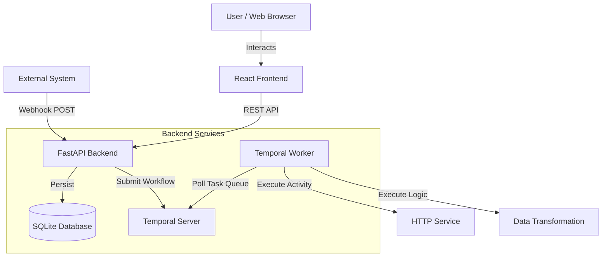

# SagePilot — Workflow Automation Engine

A simplified workflow automation engine inspired by tools like n8n and Zapier, built with **React**, **FastAPI**, and **Temporal**. This system allows users to visually create, configure, and execute multi-step workflows with durable execution semantics.

## 🚀 Key Features

*   **Visual Workflow Builder**: Intuitive drag-and-drop interface powered by React Flow.
*   **Durable Execution**: Orchestrated by Temporal, ensuring workflows survive failures and server restarts.
*   **Rich Node Library**:
    *   **Triggers**: Manual (JSON payload), Webhook (HTTP POST).
    *   **Actions**: HTTP Request, Transform Data (Multiply, Uppercase).
    *   **Logic**: Decision (Branching with operators), Wait (Durable timers).
*   **Real-time Feedback**: Live execution tracing status polling.
*   **Configuration Management**: Server-validated node configurations persisted in SQLite.

## 🏗️ Architecture

The system follows a decoupled architecture where the frontend is strictly a presentation layer, and all business logic resides on the backend.



### Components

1.  **Frontend (React + Vite)**:
    *   **State Management**: `Zustand` for global store (nodes, edges, execution status).
    *   **UI Library**: `Tailwind CSS` for styling, `Lucide React` for icons.
    *   **Visualization**: `React Flow` for the canvas.

2.  **Backend (Python FastAPI)**:
    *   **API Layer**: REST endpoints for saving, loading, executing workflows.
    *   **Persistence**: `SQLAlchemy` with `SQLite` for storing workflow definitions.
    *   **Validation**: Graph cycle detection and configuration validation.

3.  **Orchestration (Temporal)**:
    *   **Workflows**: Define the DAG traversal and execution logic.
    *   **Activities**: Execute individual node tasks (HTTP requests, transformations).
    *   **Worker**: Python worker process that executes the workflows.

## 🛠️ Tech Stack

*   **Frontend**: React (Vite), Tailwind CSS, React Flow, Zustand, Axios.
*   **Backend**: Python 3.10+, FastAPI, SQLAlchemy, Pydantic.
*   **Orchestration**: Temporal (Python SDK).
*   **Database**: SQLite (File-based).

## 🚦 Setup Instructions

### Prerequisites
*   Node.js & npm
*   Python 3.10+
*   Temporal Server (running locally)

### 1. Start Temporal Server
Ensure Temporal is running on your machine.
```bash
temporal server start-dev
```

### 2. Backend Setup
Navigate to the `backend` directory:
```bash
cd backend
python -m venv .venv
# Activate virtual environment (Windows: .venv\Scripts\activate, Mac/Linux: source .venv/bin/activate)
pip install -r requirements.txt
```

**Run the Worker** (Executes workflow tasks):
```bash
python -m temporal_workflows.worker
```

**Run the API Server** (Handles requests):
```bash
uvicorn main:app --reload --port 8000
```
*The API will be available at http://localhost:8000*

### 3. Frontend Setup
Navigate to the `frontend` directory:
```bash
cd frontend
npm install
npm run dev
```
*The UI will be available at http://localhost:5173*

## 📚 API Documentation

### Workflow Management
*   `POST /api/workflows/save`: Save a workflow (validates structure).
*   `GET /api/workflows/saved/{name}`: Load a workflow by name.
*   `GET /api/workflows/saved`: List all saved workflows.
*   `POST /api/workflows/execute`: Execute a workflow immediately.

### Webhooks
*   `POST /api/webhooks/{workflow_id}`: Trigger a workflow via webhook. Accepts JSON payload.

### Export/Import
*   `GET /api/workflows/{id}/export`: Export workflow as JSON.
*   `POST /api/workflows/import`: Import workflow JSON.

## 🧪 Workflow Execution

When you click **Run**:
1.  Frontend sends the workflow definition (Nodes + Edges + Config) to `/api/workflows/execute`.
2.  Backend validates the graph (checks for cycles, disconnected nodes).
3.  Backend starts a Temporal Workflow with a unique `run_id`.
4.  Temporal Worker picks up the task and traverses the DAG:
    *   Executes **Triigers** with initial payload.
    *   Executes **Actions** (Transform, HTTP).
    *   Evaluates **Decisions** and chooses the correct path (True/False).
    *   Pauses at **Wait** nodes using durable timers.
5.  Frontend polls `/api/executions/{run_id}` to show real-time status and logs.

## 🎨 Design Decisions

*   **Temporal for Orchestration**: Chosen for its "Code-as-a-Workflow" model. It handles retries, timeouts, and long-running processes (like Wait nodes) out of the box, which is much more robust than a custom queue-based solution.
*   **React Flow**: Selected for its ease of use in building node-based editors and customizability for the canvas interactions.
*   **SQLite**: Chosen for simplicity in this take-home assignment, but abstracted via SQLAlchemy so it can be easily swapped for PostgreSQL in production.

## 🤝 Contribution

1.  Clone the repository.
2.  Follow setup instructions.
3.  Create a branch for your feature.
4.  Submit a Pull Request.

---
**SagePilot** — *Navigate your workflows with wisdom.*
